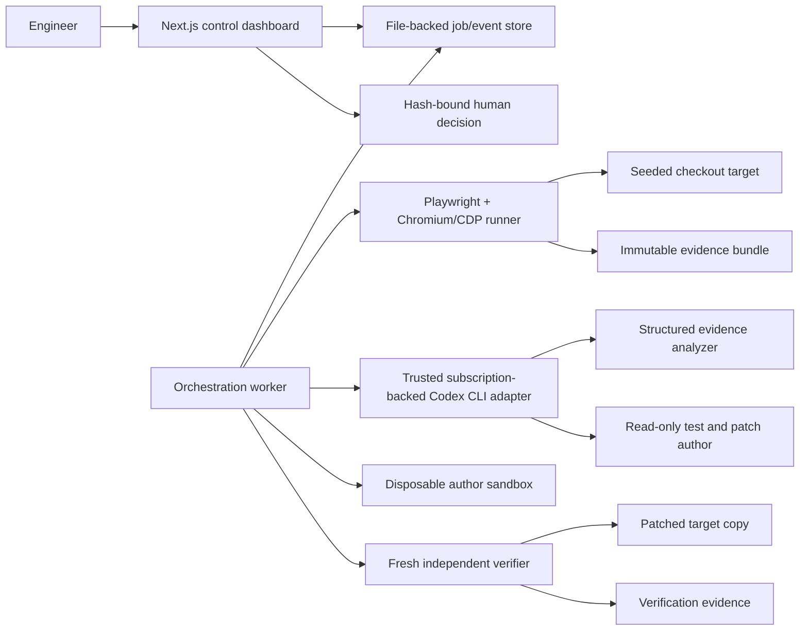

# Roveproof MVP architecture

## System shape

A local-first developer tool with two separate web applications and one single-concurrency worker:



The control dashboard never launches a browser, applies a patch, or owns model credentials. A single worker owns state transitions and filesystem writes.

## Repository layout

```text
apps/
  control/                 # Next.js dashboard + local Node route handlers
  target/                  # separate seeded Next.js checkout fixture
config/
  journeys/checkout-v1.ts
  profiles/indonesia-mobile-v1.ts
  seeds/roveproof-demo-v1.ts
packages/
  contracts/               # runtime schemas and shared types
  store/                   # atomic JSON/JSONL and artifact index
  orchestrator/            # one-job state machine
  journey/                 # Playwright actions + verifier-owned oracle
  evidence/                # capture, redaction, hashing, admission
  model-adapter/           # typed real/fixture Codex CLI adapters
  sandbox/                 # disposable workspace + diff/command policy
  verifier/                # fresh checkout, exact diff, clean rerun
  reporting/               # single-observation before/after report
scripts/
  demo-reset.ts
  demo-preflight.ts
var/roveproof/             # generated, gitignored
```

Root uses npm workspaces. Next.js Route Handlers that touch files/processes explicitly use the Node.js runtime.

## Fixed server-owned configuration

```ts
const demo = {
  targetId: "seeded-checkout-v1",
  journeyId: "checkout-v1",
  profileId: "indonesia-mobile-v1",
  seedIds: [
    "ID-MONONYM-REQUIRED-LAST-NAME",
    "ID-PHONE-PLUS62-NORMALIZATION",
    "MOBILE-HEAVY-CHECKOUT-BUNDLE",
  ],
  patchBudget: { maxFiles: 5, maxChangedLines: 250 },
  performanceBudget: { encodedBytes: 2_000_000, durationMs: 8_000 },
  maxRepairAttempts: 1,
} as const;
```

The dashboard cannot edit target URL, repository path, model ID, profile, seeds, commands, oracle, or budgets.

## Indonesia Mobile profile

- Chromium, viewport `360×800`, device scale factor 2, touch/mobile.
- `id-ID`, `Asia/Jakarta`, browser language preference including Indonesian.
- 4× CPU slowdown via CDP, verified in the manifest.
- Base network: 300 ms latency, 3.6 Mbit/s download, 750 kbit/s upload.
- One versioned deterministic jitter window applied identically to baseline and verification if the UI says “flaky”; otherwise the label is “constrained 3G.”
- Synthetic mononym, `+62` phone, Indonesian address, IDR, and Jakarta timestamp.

The throughput is intentionally compatible with the demo observations: 8.2 MB requires about 18.2 s of transfer time, while 1.4 MB requires about 3.1 s before latency/application overhead.

## Real versus fixture mode

| Area | Real mode | Fixture mode |
|---|---|---|
| Browser/evidence | Real pinned Chromium, CDP, screenshots, trace, HAR, events | Golden bundles for UI tests only |
| Checkout | Real interaction with controlled synthetic target | Same target fixtures |
| Analysis | Ephemeral read-only `codex exec` with ChatGPT subscription auth and JSON Schema output | Pre-recorded response |
| Codex authoring | Separate read-only `codex exec` calls returning typed test/source diffs | Pre-recorded diffs |
| Execution | Disposable sandbox and allowlisted checks | Not executed |
| Verification | Fresh workspace and real rerun | Golden result for rehearsal |

Fixture mode is visibly labeled and can never transition to `READY_FOR_HUMAN_REVIEW` or `APPROVED`. Its accepted rehearsal path ends at `VERIFYING_CLEAN → INCONCLUSIVE`; the dashboard may present `REHEARSAL_COMPLETE` only as projection metadata while preserving the true terminal state.

## State machine

```text
REQUESTED
→ BASELINE_RUNNING
→ BASELINE_FAILED_EXPECTED
→ ANALYZING
→ TEST_AUTHORING
→ TEST_FAILED_AS_EXPECTED
→ PATCH_AUTHORING
→ SANDBOX_GATING
→ VERIFYING_CLEAN
→ READY_FOR_HUMAN_REVIEW
→ APPROVED | REJECTED
```

Any missing/contradictory evidence, unavailable model/profile, sandbox/verifier disagreement, or infrastructure failure transitions to `INCONCLUSIVE`. Policy violations reject the candidate.

## Core components

### Control app

- `POST /api/jobs`: same-origin, bounded, idempotent creation of the one supported job.
- `GET /api/jobs/latest` and `GET /api/jobs/[id]`: validated persisted projections.
- `GET /api/jobs/[id]/events`: resumable SSE projection of persisted sequenced events.
- `POST /api/candidates/[id]/decision` (Milestone 6, not present in fixture-only Milestone 3): validates same-origin request and exact diff hash.
- Dashboard: baseline evidence, cited analysis, regression-test result, diff/policy, verification, before/after, uncertainty, and decision.

Milestone 3 keeps the Next.js dashboard as a reader/orchestrator boundary only. A filesystem-leased fixture worker is the sole event/state writer; the dashboard does not launch browsers, fabricate measurements, apply patches, or hold model credentials. Control mutations bind to loopback by default (or one explicitly configured origin), and persisted GET/SSE reads may resume an interrupted active fixture worker.

### Target app

Synthetic checkout plus idempotent order API. Baseline contains all three stable seed symptoms. No real payment or customer data.

### Journey runner

Creates an isolated context, applies and verifies profile constraints, starts collectors, executes the journey, evaluates verifier-owned assertions, finalizes artifacts, and hashes the bundle. Pass/fail comes from explicit assertions, not trace interpretation.

### Evidence admission

Validates schema, size, hashes, required artifacts, and redaction before model access. Repository content and captured pages are untrusted data, never authority-bearing instructions.

### Subscription-backed Codex CLI adapter

A trusted local host process invokes the installed Codex CLI using its existing **Sign in with ChatGPT** session. Roveproof does not use OpenAI Platform API billing and refuses `OPENAI_API_KEY`, `CODEX_API_KEY`, and `CODEX_ACCESS_TOKEN`. It never reads, copies, logs, persists, or mounts Codex credential files or credential-store contents.

Typed operations:

- `analyzeEvidence()` → ranked cited hypotheses + falsifiers + uncertainty;
- `authorRegressionTest()` → test-only unified diff;
- `authorCandidatePatch()` → source-only unified diff.

All three operations use non-interactive, ephemeral, read-only `codex exec` invocations with `--ignore-user-config` and `--ignore-rules` against bounded isolated input workspaces that contain no project Codex configuration. Analysis additionally uses `--disable shell_tool`, supplies a versioned `--output-schema`, embeds bounded textual evidence in a trusted prompt, and explicitly attaches only copied admitted screenshots. `read-only` is not represented as cwd-only read confinement; no unexpected tool event is accepted. Authoring returns typed diffs rather than applying or executing them. Only Roveproof's disposable sandbox may apply and run a proposed diff.

The adapter accepts only the pinned official-release-integrity npm launcher/runtime, invokes it through trusted Node, and passes a minimal allowlisted environment with API-key/access-token variables absent and a canonicalized executable search path. Persist CLI version, auth mode `chatgpt-subscription`, thread ID, terminal turn status, all reported aggregate usage counts, configured/observed model when exposed, latency, exit status, prompt/schema versions and hashes, retry count, and ordered input artifact hashes. Never persist credential/access-token values or raw child output. Invalid schema, refusal, login loss, quota exhaustion, CLI failure, or unavailable subscription model fails closed with no billing-mode fallback.

The complete accepted boundary is [MODEL-BACKEND-DECISION.md](MODEL-BACKEND-DECISION.md).

### Author sandbox

Fresh baseline workspace. Apply test diff first and prove the expected failure. Apply candidate source diff, then run policy scan, targeted test, relevant tests, typecheck, lint, and required build. No host secrets/home mounts; outbound network denied; resource/time/process limits; package lifecycle scripts disabled.

### Independent verifier

Destroy author workspace. Create a second clean baseline workspace, apply exact combined diff, recompute hash, launch patched target, and run the original verifier-owned journey/profile/oracle. It receives no author claims.

## Persisted records

```text
var/roveproof/
  jobs/<jobId>.json
  events/<jobId>.jsonl
  origins/<runId>.json
  snapshots/<jobId>.json
  idempotency/<sha256>.json
  leases/fixture-worker.lock
  leases/model-analysis.lock
  latest-job.json
  anchors/<runId>.json        # exclusive external index/root-hash trust anchor
  runs/<runId>/
    manifest.json
    result.json
    assertions.json
    artifact-index.json
    screenshots/
    trace.zip
    network.har
    console.jsonl
    requests.jsonl
    metrics.json
  analysis-attempts/<analysisId>/<attempt>.json
  analyses/<analysisId>.json  # content-hashed immutable success envelope
  candidates/<candidateId>/
    candidate.json
    regression-test.patch
    source.patch
    combined.patch
    command-results.jsonl
  approvals/<candidateId>.json
```

Control-job publication treats `jobs/<jobId>.json` as an atomic commit marker; idempotency and latest-job projections are reconstructed from committed jobs under the create lease after interruption. Each event carries job/run/mode provenance, and readers replay every transition against the immutable origin before API or SSE publication. The sole writer truncates an incomplete non-newline tail before the next append. Lease files use atomic publication, owner tokens, PID liveness, identity-checked release, and quarantined stale-owner takeover. Store directory chains and opened regular files are checked against the canonical artifact root.

Finalize immutable evidence data with atomic rename. Every payload artifact records SHA-256 and size; `artifact-index.json` is explicitly self-excluded and its hash/root are bound in an exclusive external run anchor. Default readers require that anchor and reject unknown major schema versions. Textual evidence is scanned for credentials and unexpected PII; binary screenshots remain safe only under the fixed-synthetic-data MVP invariant.

## Important contracts

```ts
type AnalysisReport = {
  analysisId: string;
  baselineRunId: string;
  backend: "codex-cli-chatgpt";
  authMode: "chatgpt-subscription";
  cliVersion: string;
  model: string | null;
  threadId: string;
  terminalStatus: "turn.completed";
  usage: {
    inputTokens: number;
    cachedInputTokens: number;
    outputTokens: number;
    reasoningOutputTokens: number;
  };
  startedAt: string;
  completedAt: string;
  durationMs: number;
  exitStatus: 0;
  retryCount: 0 | 1;
  promptVersion: "analysis-prompt-v1";
  promptTemplateHash: string;
  renderedPromptHash: string;
  outputSchemaVersion: "analysis-output-v1";
  outputSchemaHash: string;
  inputIndexHash: string;
  inputRootHash: string;
  inputArtifactHashes: string[];
  allowedArtifactRefs: string[]; // exact verifier-owned path/fragment catalog
  hypotheses: Array<{
    rank: number;
    code: string;
    explanation: string;
    artifactRefs: string[];
    falsifier: string;
  }>;
  recommendedRegressionAssertion: string;
  uncertainty: string[];
};

type ApprovalDecision = {
  candidateId: string;
  diffHash: string;
  decision: "APPROVED" | "REJECTED";
  actor: string;
  decidedAt: string;
  comment?: string;
};
```

Before/after contains both run IDs, baseline revision, diff hash, verdicts, durable synthetic order ID, duration, encoded bytes, available Web Vitals, assertion/error/request deltas, `sampleCount: 1`, missing artifacts, and profile deviations.

## ADRs

1. **File-backed local store:** avoids database/queue work for single concurrency.
2. **Separate target and control apps:** preserves patch/evidence boundaries.
3. **Chromium-only scored run:** CDP constraints are essential; a browser matrix is out of scope.
4. **Explicit real/fixture provenance:** no silent fallback.
5. **Two disposable workspaces:** author and verifier never share mutable state.
6. **Verifier-owned oracle/profile/seeds/budgets:** Codex cannot weaken proof.
7. **Approval exports only:** no auto-merge or deployment.
8. **Single-observation language:** no false statistical claims.
9. **Subscription-only model access:** trusted local Codex CLI with ChatGPT-managed auth; no model API keys, direct API calls, credential export, or billing-mode fallback.

## Failure handling

- Seeds/profile do not reproduce → `INCONCLUSIVE`.
- Required artifact missing/corrupt → `INCONCLUSIVE`, retain partial evidence.
- Codex login loss, subscription quota/model unavailability, refusal, CLI failure, or invalid schema → at most one bounded retry only for a classified transient CLI failure, then `INCONCLUSIVE`; never switch to API billing.
- Test already passes or fails in setup/wrong reason → reject test and stop the one attempt.
- Forbidden/oversized diff → `REJECTED`.
- Sandbox limit breach → kill full process tree and reject.
- Verifier differs from sandbox → `INCONCLUSIVE`.
- Duplicate order → verification failure.
- Stale approval hash → conflict/reject.
- Docker isolation unavailable → fixture rehearsal only; never execute generated code on host.

## Runtime preflight discovered on 2026-07-18

- Node `v22.23.0` and npm `10.9.8`: compatible with Next.js 16 requirement Node ≥20.9.
- Codex CLI `0.139.0`: installed and `codex login status` reports `Logged in using ChatGPT`.
- `OPENAI_API_KEY`, `CODEX_API_KEY`, and `CODEX_ACCESS_TOKEN`: intentionally absent and prohibited by the subscription-only decision.
- Authenticated M4 smoke: schema-valid real analysis persisted for accepted baseline `run-6fae3a3e-74f6-4c00-8626-0438d86b9aea`; CLI JSONL exposed no model identifier, so `model: null` is recorded without guessing.
- Docker CLI `29.4.3`: installed, but Docker Desktop engine was not running.
- WSL2 Ubuntu: available.

ChatGPT-managed Codex access satisfies the Milestone 4–5 model prerequisite without API credit. Docker isolation remains the blocker for executing candidate code in Milestones 5–6; until it is available, generated diffs must not execute on the host.
